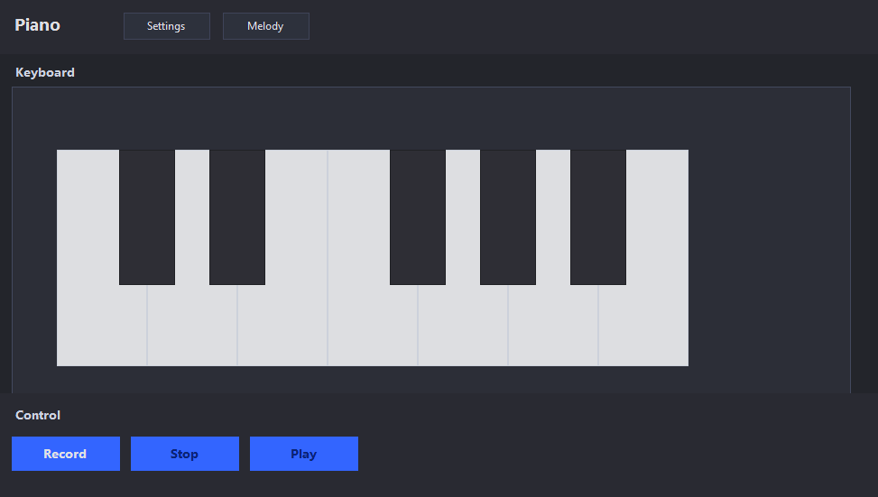
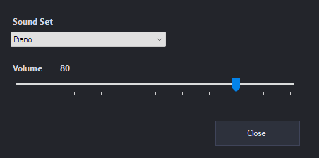
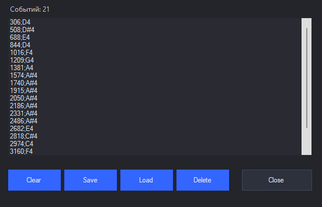

# Virtual Piano Studio

Virtual Piano Studio is a C# desktop application for playing piano notes and working with simple melodies.

## Overview

The project is a Windows Forms application that simulates a virtual piano. It includes a main piano interface, melody-related functionality, and settings management.

## Features

- Virtual piano keyboard
- Play notes from the desktop interface
- Melody window
- Settings window
- Desktop UI built with Windows Forms
- Sound generation and playback logic

## Tech Stack

- C#
- Windows Forms
- .NET Framework
- Visual Studio

## Project Structure

`	ext
Piano.sln
Project source files
README.md
`

## How to Run

1. Open Piano.sln in Visual Studio.
2. Build the solution.
3. Run the project.

## Notes

This project focuses on Windows Forms UI, sound playback, and desktop application structure.

## Screenshots

### Main Piano Window

### Settings Window

### Melody Window

